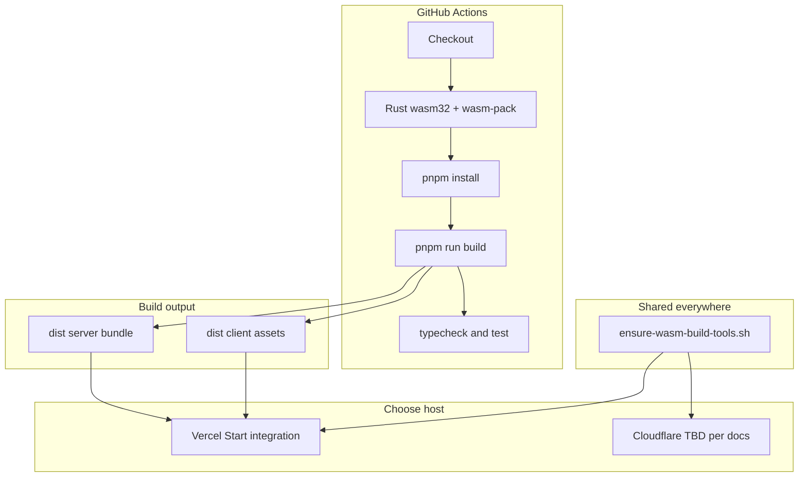

# CI (WASM) and deploy (Vercel primary, Cloudflare optional)

## Why this is needed

- [`package.json`](package.json) already chains **`pnpm run build` → `build:wasm` → Vite** ([`build/tamil_seiyul_alagi_wasm.sh`](build/tamil_seiyul_alagi_wasm.sh) → [`rsync_rust_wasm_to_web.sh`](build/rsync_rust_wasm_to_web.sh) if `rsync` exists, else [`copy_wasm_to_src.sh`](build/copy_wasm_to_src.sh)).
- [`src/wasm/`](.gitignore) is **gitignored** ([`AGENTS.md`](AGENTS.md)), so **CI and every host** must **generate** the WASM on each build.
- Default **Node-only** images (Vercel, Cloudflare Pages build, etc.) have **Node/pnpm** but not **Rust** or **wasm-pack**; `pnpm run build` fails at `wasm-pack build` unless the install/build phase runs a small **ensure-wasm** step first (same script everywhere).

**Build output (TanStack Start + Vite, verified in repo):** A normal `pnpm run build` is **not** a single “static Vite SPA” folder. With [`tanstackStart()`](vite.config.ts) in [`vite.config.ts`](vite.config.ts), the production build emits **both** **client** and **server** artifacts under `dist/` (e.g. `dist/server/server.js` and client assets in a sibling tree). That is the **default shape for TanStack Start** (full-stack app): a **server entry** is always part of the build for request handling, server functions, and **SSR when enabled**, even if *your* routes are mostly client-driven.

**Terminology:** “**SSR**” in docs usually means **HTML rendered on the server** for a request. The presence of `dist/server/...` does **not** by itself mean every page is server-rendered; it means the **Start server bundle** exists. Whether SSR is on for a given route is a **framework/route config** concern—check [TanStack Start](https://tanstack.com/start/latest) docs and your route modules when you need certainty.

**Hosting implication:** You generally **do not** point a host only at a flat “static” root of `dist` and call it done. **Vercel** is expected to use the **TanStack Start** (or Vinxi/Nitro) integration so the **server** is deployed (e.g. serverless handler) and **client** assets are served correctly. Use the [official Vercel + TanStack Start](https://vercel.com/templates/template/tanstack-start-on-vercel) (or current TanStack deploy docs) as the source of truth for **`vercel.json` / output / routes**, instead of guessing `outputDirectory: dist` as if it were a static export only.

**Cloudflare (optional):** A **static** [Pages](https://developers.cloudflare.com/pages/) project that only publishes `dist/client` (or `dist` misused as static) may **not** match what Start’s server bundle expects. Prefer **TanStack Start + Cloudflare** documentation (Workers, Node compat, or an official adapter) for a first successful deploy, or an intentional **static export** / framework mode change if the project later commits to “static only.”

## 1. GitHub Actions: build WASM + quality gates

Add [`.github/workflows/ci.yml`](.github/workflows/ci.yml) (name e.g. `CI`) with:

| Step | Purpose |
|------|--------|
| `actions/checkout` | Full repo (includes `tamil-seiyul-alagi/`) |
| `pnpm/action-setup` + `actions/setup-node` with `cache: 'pnpm'` | Match repo’s pnpm/Node usage; cache store |
| `dtolnay/rust-toolchain@stable` with `targets: wasm32-unknown-unknown` | Toolchain for `wasm-pack` |
| `Swatinem/rust-cache@v2` (workspace `tamil-seiyul-alagi`) or scoped cache key | Cut repeated compile time |
| Install **wasm-pack** | Prefer a **prebuilt** install: e.g. [`taiki-e/install-action`](https://github.com/taiki-e/install-action) with `tool: wasm-pack`; fallback `cargo install wasm-pack --locked` |
| `pnpm install --frozen-lockfile` | Reproducible deps |
| `pnpm run build` | **Proves** full production path: WASM + full TanStack Start build (client + server under `dist/`) |
| `pnpm run typecheck` | Fast TS gate |
| `pnpm run test` | Runs `test:rust` + `test:frontend` per [`package.json`](package.json) |

Triggers: `on: push` and `pull_request` (limit branches if you prefer, e.g. `malar` + PRs).

**Optional (later):** split into two jobs for parallelism; single job is fine to start.

## 2. Vercel (your existing setup): ensure WASM tools, then `pnpm run build`

**Install / build (critical):** Use a shared idempotent script, e.g. [`build/ensure-wasm-build-tools.sh`](build/ensure-wasm-build-tools.sh):

- Install [rustup](https://rustup.rs/) with `-y` if `cargo` is missing; `source "$HOME/.cargo/env"` (or extend `PATH`)
- `rustup target add wasm32-unknown-unknown`
- Ensure `wasm-pack` on `PATH` (prebuilt or `cargo install` once; no-op if already present)

**Vercel project settings (after reading TanStack Start deploy docs for your Start version):**

- **`installCommand`:** e.g. `bash build/ensure-wasm-build-tools.sh && pnpm install` (optionally `corepack enable` for pnpm)
- **`buildCommand`:** `pnpm run build` (do **not** use `build:only` or WASM is skipped)
- **Output / functions:** set **using the current TanStack Start + Vercel** guidance—account for **`dist` containing both client and server**, not a single static site root in the naive sense.

**`packageManager` in `package.json` + Node pin** (`.nvmrc` or `engines.node`) so CI and Vercel match.

## 3. Cloudflare (optional try)

- **Same** WASM + `pnpm run build` as above.
- **Do not assume** the same as “Vercel but static” until you’ve confirmed a **Start-compatible** Cloudflare path (see risks). Plain **Pages** + “publish `dist`” is often **wrong** for a server bundle unless docs say otherwise.

**Not mutually exclusive:** Preview on Cloudflare only after a documented deploy path; Vercel can remain production if Start’s Vercel story is the best fit.

## 4. Docs (README)

- **CI** + **WASM** ensure script; note **`dist` has client and server** for TanStack Start.
- **Deploy:** link to **TanStack Start deployment** (Vercel first); optional Cloudflare with caveat.

## 5. Vercel dashboard (after merge)

- Repo, branch, root `/`; follow Start template for build/install; adjust until preview matches local `vite preview` / `start` as documented.

## 6. Cloudflare dashboard (if you try it)

- Only after choosing an approach from **TanStack + Cloudflare** docs; not a copy-paste of Vercel’s static `outputDirectory` without verification.

## Risks / follow-ups

- **Cold builds** without a warm `~/.cargo` cache: minutes on first run; GHA + `rust-cache` helps.
- **Deploy mismatch:** Treating `dist` as a **static-only** Vite app will misconfigure hosts; follow **Start’s** Vercel (and any Cloudflare) deploy docs.
- **SSR product behavior:** If you need “no server-rendered HTML, ever,” that is a **separate** framework/configuration question, not the same as “no `dist/server`” — today’s build **does** emit a server bundle by default.
