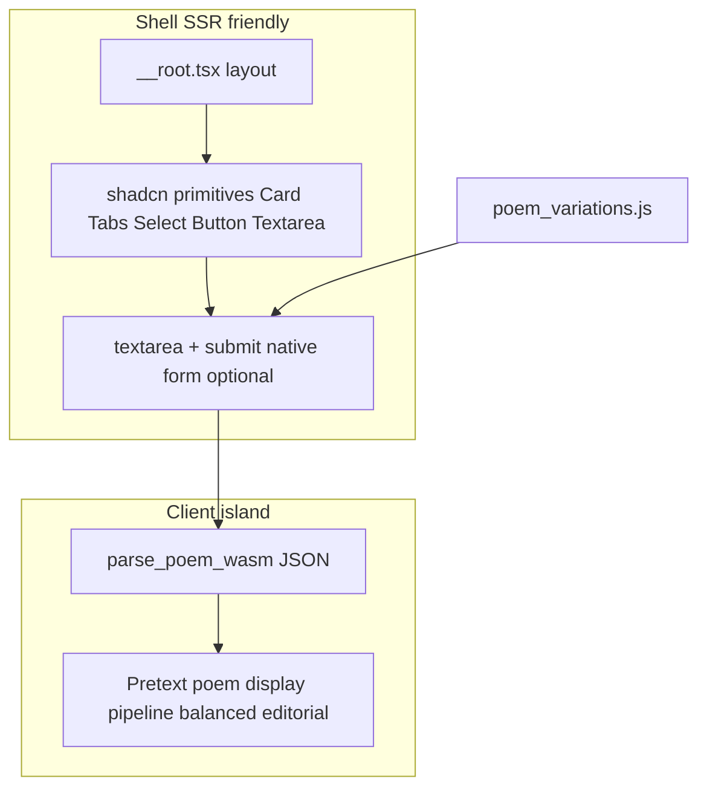

# Frontend cleanup + Pretext-first prosody UI

## Git: default branch, pollinator names, and post-merge sync

### General repo rule (all agent sessions and contributors)

This is **not** specific to the Pretext frontend slice; it applies whenever you work in this repo.

- **After every PR merge:** from repo root, run [`dx/syncagents.sh`](/home/sustainableabundance/Work/personal/thepulimaangani/dx/syncagents.sh) (fetches all, detects default branch including `malar`, rebases it, then syncs other local branches to `origin/malar` while skipping open PR heads and `legacy`). Use optional `PUSH=1` when you intend to push updated branch tips. Architecture notes: [`dx/sync-branches-architecture-simple.md`](/home/sustainableabundance/Work/personal/thepulimaangani/dx/sync-branches-architecture-simple.md).

### Default branch and how to name your branch

- **Stable default branch:** `malar` (matches remote; `origin/HEAD` or explicit fallback in tooling).
- **Pick the pollinator branch by work type** — see [trinity-and-native-agents/creators.md](/home/sustainableabundance/Work/personal/thepulimaangani/trinity-and-native-agents/creators.md) (full table).

### Fit for *this* plan (frontend / shadcn / Pretext / prosody lab)

- **`pattampoochi`** — general frontend: UI/UX, components, user flows (primary fit for the planned slice).
- **`thithali`** — optional if the slice is explicitly a short-lived UI prototype or micro-interaction spike before merging to `pattampoochi`.
- **`vannathupoochi`** — when the change set is mostly **design tokens, themes, CSS variables**, and visual-system polish rather than feature structure.
- **`thumpi`** — reserve for **AI-heavy / deep architecture / parser-core** work (not the default name for a pure UI polish PR).

**Documentation:** the `docs-branch-sync` todo is to land the **general** post-merge sync rule plus branch naming in [AGENTS.md](/home/sustainableabundance/Work/personal/thepulimaangani/AGENTS.md) and [src/AGENTS.md](/home/sustainableabundance/Work/personal/thepulimaangani/src/AGENTS.md) so every session picks it up; optionally a one-liner in [README.md](/home/sustainableabundance/Work/personal/thepulimaangani/README.md) if contributing docs already point there.

## New chat or not?

**Starting a new chat is reasonable** for this pivot: paste a short brief (goal: prosody lab UI, stack: TanStack Router/Start, Tailwind 4, add shadcn + Pretext), link to [learn-pretext.com getting started](https://learn-pretext.com/pages/getting-started.html), and point agents at [`src/AGENTS.md`](/home/sustainableabundance/Work/personal/thepulimaangani/src/AGENTS.md) + [`data/poem_variations.js`](/home/sustainableabundance/Work/personal/thepulimaangani/data/poem_variations.js). Same repo works fine; context reset is the win.

**Your preference (paraphrased):** keep the page **functional without blocking JS** where possible (native form, URL/search params, simple server path); **layer Pretext** for richer typography / flow when the client runs—defer heavier progressive-enhancement if it feels like overkill.

## Current baseline (repo facts)

- **No shadcn yet** — no `components.json`; only Tailwind + hand-rolled UI in [`src/routes/index.tsx`](/home/sustainableabundance/Work/personal/thepulimaangani/src/routes/index.tsx).
- **WASM path** is already correct: dynamic `import('../wasm/thepulimaangani_parser.js')`, `parse_poem_wasm` ([`src/routes/index.tsx`](/home/sustainableabundance/Work/personal/thepulimaangani/src/routes/index.tsx) ~L67–70).
- **Samples**: inline “Load Sample Poem” only; [`data/poem_variations.js`](/home/sustainableabundance/Work/personal/thepulimaangani/data/poem_variations.js) is **not** imported by the frontend yet (Rust tests reference it conceptually).

## Target architecture

- **shadcn/ui**: layout chrome, controls, focus states, dialogs/sheets if needed—per project preference and [shadcn Tailwind v4 notes](https://ui.shadcn.com) (init may need current CLI flags for your Vite setup).
- **Pretext.js**: primary “exploit” area—**Pipeline**, **balanced text**, **editorial layout** (from their docs) for (1) the live poem block and (2) parse output as structured text flow (not only a raw JSON dump). Verify **exact npm package name and React usage** from [Getting Started](https://learn-pretext.com/pages/getting-started.html) / [API reference](https://learn-pretext.com/pages/api-reference.html) before locking APIs.
- **Tailwind**: keep design tokens in [`src/styles.css`](/home/sustainableabundance/Work/personal/thepulimaangani/src/styles.css); map shadcn CSS variables into your existing `--sea-ink` / `--lagoon` palette where it makes sense.

## Implementation phases

1. **Tooling + shadcn foundation**  
   - Add `components.json`, dependencies (class-variance-authority, clsx, tailwind-merge, `@radix-ui/*` as pulled by components).  
   - Install a minimal set: **Button**, **Textarea**, **Card**, **Tabs**, **Select** (or **Combobox**), **Separator**, optional **Sheet** for mobile sample drawer.  
   - Replace generic meta title in [`src/routes/__root.tsx`](/home/sustainableabundance/Work/personal/thepulimaangani/src/routes/__root.tsx) (“TanStack Start Starter” → Thepulimaangani).

2. **Data wiring for testing**  
   - Import `poemVariations` / `poemVariationExamples` from [`data/poem_variations.js`](/home/sustainableabundance/Work/personal/thepulimaangani/data/poem_variations.js): either enable `allowJs` + typed wrapper, or generate a thin `src/data/poemVariations.ts` that mirrors keys (prefer **single source of truth**—likely `allowJs` import from `../data/...` with a small `.d.ts` if needed).  
   - **Sample picker**: group by metre (`venpaa`, `aciriyappa`, …) using `special_types` / `variations`; set textarea `en` + load `example`.

3. **Pretext-heavy “prosody surface”**  
   - Extract a **`PoemViewport`** (client-only): receives Tamil string + optional width; uses Pretext for **line rhythm**, **balanced wrapping**, **editorial column** for long kāppu samples.  
   - Extract **`ParseOutputViewport`**: feed parser JSON (parse + `JSON.parse` once validated) into Pretext pipeline for **staged reveal** or columnar technical display (feet, metre)—exact pattern from docs.  
   - Keep a **plain `<pre>` or typography fallback** inside the same route for no-JS / SSR first paint if you want alignment with your “native first” note (optional slice-2).

4. **De-boilerplate TanStack starter**  
   - Trim [`TanStackDevtools`](/home/sustainableabundance/Work/personal/thepulimaangani/src/routes/__root.tsx) to dev-only (`import.meta.env.DEV`).  
   - Tighten [`about.tsx`](/home/sustainableabundance/Work/personal/thepulimaangani/src/routes/about.tsx) / header/footer copy to project voice.  
   - Split [`index.tsx`](/home/sustainableabundance/Work/personal/thepulimaangani/src/routes/index.tsx) into `src/components/prosody/*` + hooks (`useWasmParser`) for readability.

5. **Quality gates**  
   - `pnpm run typecheck` + `pnpm run test:frontend`; manual smoke on `/` after `pnpm run build:wasm`.

## Risks / decisions baked in

- **Pretext + SSR**: wrap Pretext roots in a client-only module (e.g. lazy `import()` + `ssr: false` if TanStack Start exposes it for that route segment, or a `ClientOnly` mount with `useEffect`) so the shell stays stable.  
- **Tamil fonts**: keep `font-tamil`; ensure Pretext measurement uses the same **computed font stack** as the visible text (their “caveats” docs—read [Caveats & Recipes](https://learn-pretext.com/pages/caveats.html) when integrating).

## Out of scope for first slice

- Rewriting Rust prosody logic.  
- Full URL-driven state machine (search params for sample id)—nice follow-up after the lab works.
