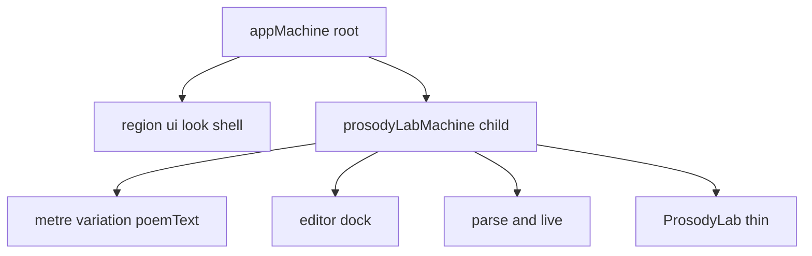

# Frontend prosody: state machine refactor and thin components

## Problem today

- **[ProsodyLab.tsx](src/components/prosody/ProsodyLab.tsx)** (≈220 lines) mixes **sample catalog** state (metre tab, `selectedEn`, `poemText`), **editor dock** state (`open`, `poemDraft`), **manual parse** via [useWasmParser.ts](src/hooks/useWasmParser.ts), and **live preview** via [useDebouncedParsedPoem.ts](src/hooks/useDebouncedParsedPoem.ts) with ad hoc `useEffect` for row sync when metre changes.
- **[ParseResultPanel.tsx](src/components/prosody/ParseResultPanel.tsx)** (≈235 lines) bundles JSON footer actions, **IntersectionObserver** + scroll **sentinel** behavior, and several **mutually exclusive render branches** (empty / error / live-only / full tabs) in one file.
- **No** `xstate` in the project yet; logic is spread across hooks and component `setState` chains—harder to reason about and to extend (e.g. `look: real|fantasy` from the [real/fantasy theme plan](file:///home/sustainableabundance/.cursor/plans/real_fantasy_theme_plan_caeaa22d.plan.md)).

## Target architecture: app machine + prosody machine (sync without glue)

**Intent you described:** one **app** machine for **complex / cross-feature** flow, one **prosody** (logical) machine for **lab interactions** — and they should **stay in sync** without “extra effort.”

**The natural XState v5 shape:** not two **independent** root actors that subscribe to each other, but **one hierarchy**:

- **[app.machine.ts](src/machines/app.machine.ts)** (root): `context` and/or **child refs** for feature domains, `type: "parallel"` regions if you want **e.g.** `ui` ( `look: 'real' | 'fantasy'`, later nav) and `routing` side-by-side, and a **`prosody`** child defined via **`system` / `invoke` with `id: "prosody"`** or `spawn` from `setup` `actors: { prosody: prosodyLabMachine }`.
- **[prosodyLab.machine.ts](src/machines/prosodyLab.machine.ts)**: the **only** owner of `poemText`, sample selection, editor dock, `PARSE` / live debounce. Events are namespaced (e.g. `prosody.*`) in **type unions** to avoid clashing with `app.*` when you merge types.

**Why this feels like “no extra sync”:** the **parent** is the **single source of orchestration**; the child is **always** in the same snapshot tree when you `inspect` / persist / devtools. You forward events with `sendTo('prosody', { type: '...' })` or child sends `toParent` only when the **shell** must react (e.g. “teardown editor on look change” — optional).

- **App machine** holds **low-frequency** and **global** rules (real/fantasy, future: URL defaults, a11y announcements). It does **not** duplicate `poemText` unless a future feature (e.g. “share poem in URL”) is implemented as **prosody → parent** assign or a single `sync` event — avoid copying the same string in two `context` blobs.

- **Prosody machine** (file e.g. [src/machines/prosodyLab.machine.ts](src/machines/prosodyLab.machine.ts)) owns **lab** context and **lab** events. UI subscribes with `useSelector` on the **prosody** `ActorRef` (from `useSelector(appActor, s => s.children.prosody)` or a dedicated `ProsodyProvider` that only wraps the home route) or passes `actor={prosodyRef}`. **Dumb** presentational components stay unchanged in spirit.

### Blind spots (so “natural” does not become bugs)

- **Two root-level `createActor` instances** (app + prosody) **without** a parent/child link: you will manually `subscribe` / forward events; easy **desync** and **ordering** bugs. **Prefer** one `app` actor that **invokes/spawns** prosody.
- **Duplicated fields** in `app.context` and `prosody.context` (e.g. `poemText` in both): they **will** drift. **Rule:** domain data lives in **one** machine; the other holds only **IDs or nothing**.
- **Persistence / rehydration:** if you `localStorage` both, define **one** persisted snapshot (usually **root** `app` snapshot) that includes the **child** state, or only persist the **prosody** child id + minimal keys — and **one** rehydration order in the **inline script** in [__root.tsx](src/routes/__root.tsx) (align with your theme + look plan).
- **SSR / hydration:** one actor tree in React must **match** server render; **don’t** create the prosody child only on the client without guarding the first paint, or the tree mismatch will bite TanStack Start.
- **Event name collisions** when typing `Event` as a union: use **prefixes** or separate `ProsodyEvents` / `AppEvents` and `send` with a typed envelope.
- **Tests:** test **prosody** in isolation; test **app** with a **mock** child or stub `actors.prosody` so app transitions do not need full WASM in vitest.
- **Parallel regions** (XState `type: 'parallel'`) keep concerns explicit without multiple nested providers:
  - `samples` — `metreKey`, `selectedEn`, `poemText`; events `METRE.SET`, `SAMPLE.SELECT` (and internal effect to re-point `selected` when `flatRows` change).
  - `editor` — `open`, `draft`; events `EDITOR.OPEN`, `EDITOR.CLOSE`, `DRAFT.SET`, `APPLY` (apply copies `draft` → `poemText` and closes).
  - `parse` — `result`, `loading`, `validationError` for the **Parse poem** button path; `PARSE` invokes existing [runWasmParse](src/lib/wasmParse.ts) + [validatePoemInput](src/lib/prosodyValidation.ts) (same behavior as [useWasmParser](src/hooks/useWasmParser.ts)).
  - `live` — debounced preview source derived from `editor.open ? editor.draft : samples.poemText`; either **invoke** a small async service or a **sequence** of `after` + parse that updates `LivePreviewState` (mirror [useDebouncedParsedPoem](src/hooks/useDebouncedParsedPoem.ts) semantics: `layoutVersion`, hold last `parsed` through `syncing`/`pending`, etc.).

**Terse code:** use **setup()** with typed `context`, `events`, `actions`, `actors`, and **guards** so transitions read as a table, not `if` trees in React.

**Separation:**

| Concern | Owns it | React |
|--------|---------|--------|
| When to parse, debounce, errors | `prosodyLab` machine + actors | None |
| Layout and a11y | Small components | Yes |
| WASM / JSON adapt | Existing `lib/*` | Invoked from machine only |

## Shrink "fat" components (concrete splits)

- **ParseResultPanel** → keep a thin **orchestrator** (~80 lines) that **selects** which sub-view to show; move to separate files (same folder or `parseResult/`):
  - `parseResultEmptyState.tsx` — no text, no result
  - `parseResultErrorState.tsx` — `result` present but not valid JSON
  - `parseResultTabsView.tsx` — live / structure / flow + footer (compose `StructuredParseResult`, `PretextLineViewport`, `SyllableLivePreview`)
  - `JsonActionsFooter.tsx` — already a function in the same file; **extract to its own module**
  - `LiveSyllableWithSentinel.tsx` — **IntersectionObserver** + `scrollIntoView` + `SyllableLivePreview` (the current `LiveSyllableAndSentinel` block)
- **ProsodyLab** — after the machine, reduce to:
  - `PoemAndParseCard` — `PoemFitPreview` + validation + parse button
  - `SamplesCard` — tabs + `Select` (metre/ variation)
  - Optional: `useProsodyPreviewSource` becomes **selector** on context: `editor.open ? editor.draft : samples.poemText` (no hook).

## Theme `look` (real/fantasy) hook-in

- Put **`ui.look`** on the **app** machine (parallel `ui` region is enough); **prosody** does not own theme. **Subscribers:** header toggle + `data-look` in [__root.tsx](src/routes/__root.tsx) FOUC script read the **same** persisted key as the app snapshot.
- If **fantasy** should reset or freeze something in the lab later, that is a **single** `LOOK.TOGGLE` transition on `app` that `sendTo('prosody', ...)` on enter — explicit, not magic.
- Order of work: **app + prosody structure first**, then theme, so you do not re-thread `useState` twice.

## Files to add / touch (summary)

- Add: [src/machines/app.machine.ts](src/machines/app.machine.ts) (root: `ui` + `prosody` child)
- Add: [src/machines/prosodyLab.machine.ts](src/machines/prosodyLab.machine.ts), [src/machines/prosodyLab.types.ts](src/machines/prosodyLab.types.ts) (if you want public event/context types for tests)
- Add: one shell provider, e.g. [src/components/AppActorProvider.tsx](src/components/AppActorProvider.tsx) (or extend [__root.tsx](src/routes/__root.tsx) client boundary) — **prosody** can use `getChild('prosody')` or a tiny [ProsodyLabProvider.tsx](src/components/prosody/ProsodyLabProvider.tsx) that only forwards the child `ActorRef` for selectors on the home route
- Refactor: [ProsodyLab.tsx](src/components/prosody/ProsodyLab.tsx), [ParseResultPanel.tsx](src/components/prosody/ParseResultPanel.tsx)
- Remove or narrow: [useWasmParser.ts](src/hooks/useWasmParser.ts) and [useDebouncedParsedPoem.ts](src/hooks/useDebouncedParsedPoem.ts) — **delete** if fully superseded by the machine, or keep **only** a thin `useLivePreview` re-export for tests that still expect a hook (prefer deleting to avoid two sources of truth)

## Quality gates

- `pnpm run typecheck` and `pnpm run test`
- Manual: change metre, pick sample, open editor, type (live preview + scroll), parse, copy JSON, export

## Out of scope for this pass

- URL/search-param sync for sample id (follow-up; machine can add `SAMPLE.LOAD` from URL later)
- Changing WASM or Rust
- Inverting control so **prosody** drives **app** for anything except the rare shell rule (keeps the graph readable if app stays the orchestrator)
