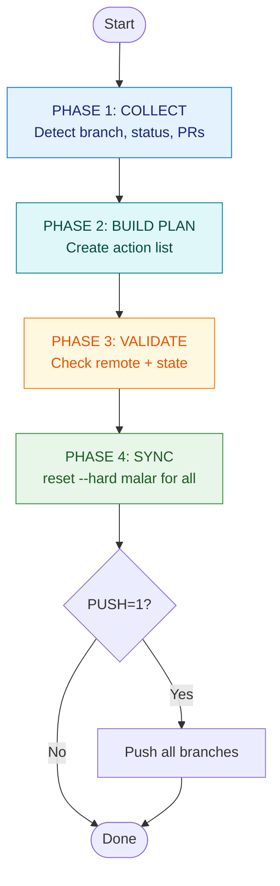

# sync-branches Architecture Diagram



## Key Design Principles

- **Only active PR branches are skipped**
- **All other branches use `git reset --hard origin/malar`**
- **File-based plan storage** for reliability
- **Vibrant truecolor output** for excellent terminal experience

---

## Autonomous agents & safety (read before handover)

This flow is **powerful and destructive by design**. Handing `./dx/syncagents.sh` to an autonomous agent without guardrails can create a mess: **lost commits**, **wrong remotes rewritten**, **stash conflicts**, and **silent alignment of every role branch to `malar`**.

### Where the mess comes from

1. **`git reset --hard origin/<default>`** on almost every local branch (except the default branch and `legacy`). Any **local-only commits** on those branches are gone from the ref (they may linger unreachable until GC).
2. **`ensure_remote_tracking_locals`** creates a local `origin/*` mirror, then the same reset runs on it — so **newly created tracking branches immediately match `malar`**, not “whatever was only on the remote feature tip” unless that tip equals `malar`.
3. **`PUSH=1`** runs **`git push --force-with-lease`** on **all** non-default branches — this can **rewrite remote history** for every pushed branch if tips diverged.
4. **Open PR detection** uses **`gh pr list`** for **this repo only**. If `gh` is missing, mis-authenticated, or pointed at the wrong host, the **active PR skip list can be empty** → **every branch including in-flight work gets reset**.
5. **Dirty working tree** → stash before sync, stash pop after — merge conflicts or partial pops can leave a **dirty or broken tree**.
6. **`legacy` is skipped** for reset but is still a normal local branch otherwise — do not assume “skip” means “safe to pile WIP there”.

### Guards and flow (recommended for humans and agents)

| Guard | Why |
|--------|-----|
| **Run `DRY_RUN=1 ./dx/syncagents.sh` first** | Prints the plan (including `[DRY] Would reset…`) without mutating refs. |
| **Clean or intentional tree** | Commit or stash WIP *before* sync; avoid running with half-applied merges. |
| **Verify `gh auth status` and `gh pr list`** | Ensures open PR heads are detected so those branches are **skipped**. |
| **Open a draft PR before sync** if a branch must survive | Only **open** PR heads are skipped; un-pushed or “no PR” work on a named branch is **not** protected. |
| **Never set `PUSH=1` unless explicitly requested** | Avoids mass **force-with-lease** to remotes. |
| **Confirm `origin` and default branch** | Script uses `origin` and `origin/HEAD` (fallback: `malar`). Wrong remote = wrong reset target. |
| **One agent / one machine per run** | Avoid concurrent syncs on the same clone. |
| **After merge: pull `malar` normally** | `syncagents` is for **branch-tip alignment**, not a substitute for `git pull` on your current feature branch when you are mid-development. |

### High-level flow (what the script does)

1. **Collect:** `git fetch --all --prune` → **create missing `origin/*` tracking branches locally** → resolve default branch → optionally checkout default and pull → record dirty/clean → list **all local branches** except default + `legacy` → **`gh pr list` (open)** for skip set.
2. **Plan:** default-branch update; optional stash; for each branch → **skip** if open PR head else **reset** action; cleanup; restore stash; return to original branch.
3. **Validate:** remote reachable.
4. **Sync:** execute plan (`reset --hard origin/<default>` per branch); optional **`PUSH=1`** force-with-lease push of all non-default locals.

Treat **`./dx/syncagents.sh`** as a **fleet-wide local branch normalizer**, not a gentle `git pull`. When in doubt, **`DRY_RUN=1`** and human review of the printed plan.

---

## State Machine Flow

```
COLLECT → BUILD PLAN → VALIDATE → SYNC → DONE
```

This tool follows a clean state machine pattern with predictable transitions between phases.