# sync-branches Architecture Diagram

```mermaid
flowchart TD
    Start([Start]) --> Phase1

    subgraph Phase1["PHASE 1: COLLECT"]
        direction TB
        P1_1["Detect default branch<br>using symbolic-ref"]
        P1_2["Get current branch + dirty status"]
        P1_3["List all local branches<br>(exclude default + legacy)"]
        P1_4["Fetch active PR branches<br>via gh pr list"]
        P1_5["Store state in variables<br>+ temp files"]
        
        P1_1 --> P1_2 --> P1_3 --> P1_4 --> P1_5
    end

    Phase1 --> Phase2

    subgraph Phase2["PHASE 2: BUILD PLAN"]
        direction TB
        P2_1["Always: update_default_branch"]
        P2_2{Working tree dirty?}
        P2_3["If dirty → stash_changes"]
        P2_4["For every non-PR branch<br>→ rebase_branch:name"]
        P2_5["Always: cleanup_deleted_branches"]
        P2_6["If dirty → restore_stash"]
        P2_7{Not on default branch?}
        P2_8["checkout_original_branch"]
        
        P2_1 --> P2_2
        P2_2 -->|Yes| P2_3
        P2_2 -->|No| P2_4
        P2_3 --> P2_4 --> P2_5 --> P2_6 --> P2_7
        P2_7 -->|Yes| P2_8
        P2_7 -->|No| P2_9["Plan saved as ordered list"]
        P2_8 --> P2_9
    end

    Phase2 --> Phase3

    subgraph Phase3["PHASE 3: VALIDATE"]
        direction TB
        P3_1["Check remote connectivity<br>git ls-remote --heads origin"]
        P3_2["Verify working tree state"]
        P3_3["Fail fast with clean exit<br>if any issue found"]
        
        P3_1 --> P3_2 --> P3_3
    end

    Phase3 --> Phase4

    subgraph Phase4["PHASE 4: SYNC"]
        direction TB
        P4_1["update_default_branch<br>→ git checkout + git pull --rebase"]
        P4_2["rebase_branch:name<br>→ git reset --hard origin/malar"]
        P4_3["cleanup_deleted<br>→ delete *--to-be-deleted branches"]
        P4_4{PUSH=1?}
        P4_5["git push --force-with-lease<br>for all branches"]
        P4_6["restore_stash → git stash pop"]
        P4_7["checkout_original<br>→ return to starting branch"]
        
        P4_1 --> P4_2 --> P4_3 --> P4_4
        P4_4 -->|Yes| P4_5 --> P4_6 --> P4_7
        P4_4 -->|No| P4_6 --> P4_7
    end

    Phase4 --> End([Done])

    style Phase1 fill:#e3f2fd,stroke:#1976d2,stroke-width:2px,color:#0d47a1
    style Phase2 fill:#e0f7fa,stroke:#00838f,stroke-width:2px,color:#004d40
    style Phase3 fill:#fff8e1,stroke:#f57c00,stroke-width:2px,color:#e65100
    style Phase4 fill:#e8f5e9,stroke:#388e3c,stroke-width:2px,color:#1b5e20
```



## Key Design Principles

- **Only active PR branches are skipped**
- **All other branches use `git reset --hard origin/malar`** (clean and predictable)
- **File-based plan storage** for reliability
- **Vibrant truecolor output** for excellent terminal experience
- **Clean separation of concerns**: Collect → Build Plan → Validate → Sync

---

## State Machine Architecture

This tool implements a **finite state machine** with a clear graph-based flow:

```
COLLECT → BUILD PLAN → VALIDATE → SYNC → DONE
```

Each phase is a distinct state with well-defined transitions. The plan is built as an ordered list of actions (like a graph), and the executor follows the path sequentially with proper error handling and rollback support.