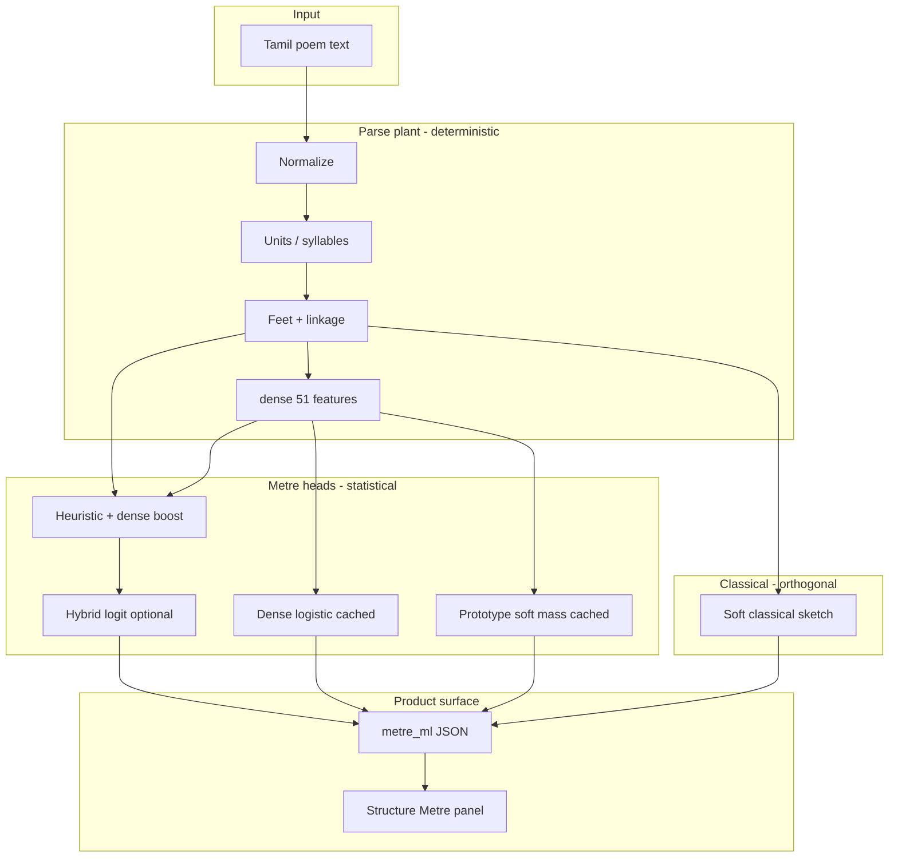
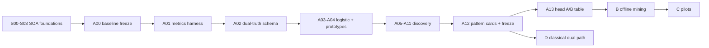
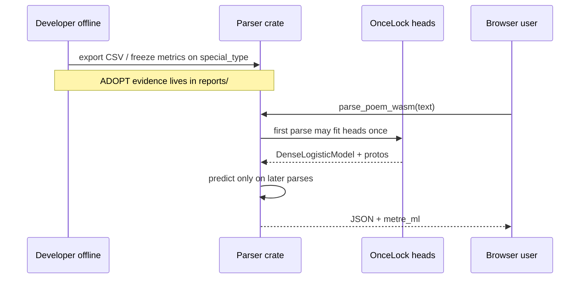

# How metre machine learning works here (beginner guide)

**Audience:** engineers and learners new to this repo’s ML path.  
**Goal:** understand the **pipeline**, what each **step** is for, how steps **feed the next**, and what **outputs mean** in the UI.

Related (deeper / normative):

| Doc | Role |
|-----|------|
| [`METRE_ML_METHODS_PORTFOLIO.md`](METRE_ML_METHODS_PORTFOLIO.md) | Full Tier A–D research menu + ADOPT protocol |
| [`METRE_PREDICTION.md`](METRE_PREDICTION.md) | Hybrid/heuristic head behaviour & side effects |
| [`PARSE_FEATURES.md`](PARSE_FEATURES.md) | Exact `dense[51]` layout |
| [`TRAINING_PROCESS.md`](TRAINING_PROCESS.md) | CSV/JSONL export & Monte Carlo |
| This guide | Story of the system + I/O examples |

---

## 1. One-sentence story

We **do not** feed raw Tamil into a big neural net for the product path. We **parse** the poem into structure, **summarize** it as 51 numbers (`dense`), then **guess coarse metre** (Venpaa / Aciriyappaa / Kalippaa / Vanjippaa) with small models—and we keep **classical rule checks separate** so they never secretly rewrite the ML score.

---

## 2. Terms (glossary)

| Term | Meaning here |
|------|----------------|
| **Poem / line / foot / syllable (acai)** | Structural units. Today roughly: foot ≈ whitespace word. |
| **Ner / Nirai (நேர் / நிரை)** | Syllable classes used for scansion. |
| **Talai / linkage** | Bond between consecutive feet (VenTalai, AciriyaTalai, …). |
| **Coarse metre** | One of four labels: Venpaa, Aciriyappaa, Kalippaa, Vanjippaa. |
| **`dense[51]`** | Numeric summary of the parse (counts + linkage histograms + foot bins). **No raw poem text.** |
| **Heuristic head** | Hand-written score rules + dense boosts → 4 ranked hypotheses. |
| **Hybrid head** | Small shipped logistic on dense ∥ heuristic scores (when weights active). |
| **Soft mass (0–1)** | Relative strength of a head’s vote—not a scientifically calibrated “% chance of being right”. |
| **Entropy / margin** | How peaked the 4-way distribution is (uncertainty), not classical proof. |
| **Dual-truth** | ML guess and classical sketch live side by side; **never fused into one score**. |
| **Soft classical sketch** | Lightweight structural flags (e.g. “low VenTalai mass”). **Not** full classical scholarship. |
| **`special_type`** | Primary gold rows for ADOPT metrics (anthology). |
| **`variation`** | Stress / hard rows—report separately; don’t bulk-train as gold. |
| **In-sample** | Evaluating a model on poems it was fitted on (looks good, can over-claim). |
| **ADOPT freeze** | Dated metrics on the agreed primary path (baseline report), not “UI looks confident”. |
| **SOA** | Semantics · Ontology · Anthology foundations (S00–S03) that pin meaning before ML experiments. |

---

## 3. Big picture architecture



**Separation principle (control-systems metaphor):**  
The **plant** is the parser (structure). The **observer** is ML (beliefs about metre). The **constraint module** is classical sketch. Observers don’t rewrite the plant; constraints don’t silently rewrite the observer’s score.

---

## 4. End-to-end live path (what the browser runs)

### Step A — User types a poem

**Input example** (short Venpaa-like line pair):

```text
முற்ற உணர்ந்தானை ஏத்தி மொழிகுவன்
குற்றமொன்று இல்லா அறம்
```

### Step B — WASM `parse_poem_wasm`

Rust builds:

1. syllables, feet, linkage  
2. `parse_features.dense` (length 51)  
3. `top_k_metre_hypotheses` (up to 4)  
4. optional `metre_entropy_bits`, `metre_epistemic_margin`  
5. `metre_ml` product block (honesty, dual-truth, multi-head, pattern features)

**Output (conceptual JSON excerpt):**

```json
{
  "metre_type": "Venpaa",
  "metre_entropy_bits": 0.05,
  "metre_epistemic_margin": 0.99,
  "top_k_metre_hypotheses": [
    { "metre_type": "Venpaa", "metre_probability": 0.99, "metre_rank": 1 },
    { "metre_type": "Aciriyappaa", "metre_probability": 0.005, "metre_rank": 2 }
  ],
  "parse_features": { "schema_version": 1, "dense": [/* 51 floats */] },
  "metre_ml": {
    "honesty_label": "Statistical estimate (ML / heuristic) — not classical proof",
    "dual_truth": {
      "ml_metre_type": "Venpaa",
      "classical_ok_for_ml_top": true,
      "classical_violations": [],
      "separation_policy": "ml_scores_parallel_to_classical_violations"
    },
    "head_votes": [
      { "head_id": "heuristic_or_hybrid", "metre_type": "Venpaa", "score": 0.99 },
      { "head_id": "dense_logistic", "metre_type": "Venpaa", "score": 0.38 },
      { "head_id": "prototype_knn", "metre_type": "Venpaa", "score": 0.46 }
    ],
    "pattern_features": [
      { "dense_index": 12, "feature_id": "…", "weight": 0.8, "direction": "positive" }
    ]
  }
}
```

**What the numbers mean:**

| Field | Meaning | What it is *not* |
|-------|---------|------------------|
| `metre_type` | Best guess after heuristic (+ hybrid if active) | Proof of classical metre |
| `metre_probability` | Softmax mass for that class when hybrid ran | Guaranteed accuracy % |
| `score` on head_votes | Soft mass / relative strength **0–1** | Calibrated confidence % |
| `classical_violations` | Soft structural sketch flags | Tolkappiyam exam pass |

### Step C — TypeScript adapt

`adaptWasmJsonToParsedPoem` maps wire JSON → `ParsedPoem` (including `metre_ml`).  
UI must bind **only** to adapted fields, not invent demo strings.

### Step D — UI (Structure → Metre)

Shows:

1. Honesty badge  
2. Entropy / margin (if present)  
3. Hypothesis list  
4. Dual-truth (ML ∥ soft classical)  
5. Multi-head soft masses (unitless 0.00–1.00)  
6. Pattern features (top dense signals for *this* poem)

---

## 5. How research steps chain (S → A → B → C → D)

Think of steps as a **ladder**: each rung freezes meaning or evidence so the next rung doesn’t cheat.



### Foundation: SOA (S00–S03) — *what exists / what symbols mean / what corpus we trust*

| Step | Aids the next by… |
|------|-------------------|
| **S00 Ontology** | Fixed entity list (Poem→…, MetreType, Talai, cir). Later code can’t invent silent enums. |
| **S01 Semantics** | Fixed `dense[j]` meanings and score scales. Features stay comparable after code changes. |
| **S02 Anthology** | Declares **special_type** primary gold vs **variation** stress. Stops poisoned training. |
| **S03 SOA ledger** | Fingerprint of all of the above. A00+ may refuse work if fingerprint drifts. |

### Tier A — *measure, then small models, then freeze patterns*

| Step | Input | Output | Feeds |
|------|-------|--------|-------|
| **A00 Baseline** | special_type parses | Dated top-1 / MRR / CI | ADOPT gate for “did we break the primary path?” |
| **A01 Metrics** | gold + ranked lists | top-1, MRR, correct@2, bootstrap | Fair comparisons between heads |
| **A02 Dual-truth** | ML + classical slots | Wire fields side by side | UI honesty without fusion |
| **A03 Dense logistic** | standardized dense | Soft class probabilities | Multi-head UX + A13 |
| **A04 Prototypes** | z-space class means | Soft inverse-distance mass | Second opinion head |
| **A05 PCA/LDA** | dense matrix + labels | Loadings / directions | Interpret which features matter |
| **A06 MI / χ²** | dense + discrete bins | Information + association strength | Feature ranking / rules |
| **A07 Calibration** | probs vs correct | ECE / temperature ideas | Honest probability talk |
| **A08 Association** | discrete items | Rules “item ⇒ class” | Human-readable patterns |
| **A09 Motifs** | Ner/Nirai streams | Frequent substrings | Sequence vocabulary |
| **A10 Ablation** | dense with blocks zeroed | Sensitivity of distance/score | Which feature blocks matter |
| **A11 Counterfactual** | flip one dense index | Score shift | Causal-ish probes |
| **A12 Pattern cards** | class means vs global | Per-metre top features + disagreement set | Freeze before classical |
| **A13 Head A/B** | same gold, many heads | Table of metrics | Choose/document heads |

### Tier B–C — *offline research (optional in WASM)*

B/C modules deepen understanding (trees, clustering, HMM sketches, active learning).  
They **do not** have to all appear in the learner UI. Product WASM can build with `--no-default-features` to omit offline crates (`ml-eval-offline` feature).

### Tier D — *classical after A12 freeze*

| Step | Role |
|------|------|
| **D01** | Soft classical sketch violations (A12-gated) |
| **D02** | Solver scaffold (`ilp_sat_feasible`) — research |
| **D03** | Dual-compare report (agree / ml-only / flags) |

**Critical:** D never overwrites hybrid `aggregate_score`. UI shows classical as **soft sketch**.

---

## 6. Training vs live inference (don’t confuse them)



| Activity | Data | Purpose |
|----------|------|---------|
| **Baseline freeze / MC** | special_type | ADOPT / regression |
| **Live multi-head** | fitted on full special_type, then predict | UX comparison (**in-sample** if you parse those poems) |
| **variation** | stress | See where models fail; not sole ADOPT |

See also [`data/training/reports/sample_mismatches.md`](../data/training/reports/sample_mismatches.md).

---

## 7. Worked mini-example: feature → head → UI

**Suppose** after parse, dense has high mass at linkage VenTalai bin and few feet.

1. **Heuristic** boosts Venpaa hypothesis → top hypothesis `Venpaa`.  
2. **Hybrid** (if active) re-ranks with softmax → `metre_probability` high for Venpaa.  
3. **Dense logistic** (cached, z-scored) may also vote Venpaa with soft mass ~0.3–0.9.  
4. **Prototype** votes with inverse-distance soft mass.  
5. **Classical sketch** may return `[]` or a soft flag like `classical:venpaa_low_ventalai_mass`.  
6. **UI** shows all of the above with honesty label—learner sees **comparison**, not a single “truth meter”.

---

## 8. Commands you’ll actually use

```bash
# Parser tests
cargo test --manifest-path tamil-seiyul-alagi/Cargo.toml

# Freeze baseline / A05–A13 / D03 style measure packs
cargo run --manifest-path tamil-seiyul-alagi/Cargo.toml --example freeze_tier_measure_artifacts

# Multi-head mismatch table (special_type + variation)
cargo run --manifest-path tamil-seiyul-alagi/Cargo.toml --example export_sample_mismatches

# Product WASM (offline research modules off)
pnpm run build:wasm

# Frontend adapt tests
pnpm exec vitest run src/lib/__tests__/metreMlAdaptUi.test.ts
```

---

## 9. Code map (where to look)

| Concern | Path |
|---------|------|
| Parse orchestration | `tamil-seiyul-alagi/src/lib.rs` (`parse_poem`) |
| Heuristic / hybrid | `src/metre/prediction.rs`, `src/metre/ml_head.rs` |
| Dense features | `src/parse_features.rs`, `PARSE_FEATURES.md` |
| Product ML surface | `src/ml_eval/product_surface.rs` |
| Cached logistic | `src/ml_eval/dense_logistic.rs` + `cached_product_heads()` in `lib.rs` |
| Soft classical | `src/metre/classical_checker.rs` |
| TS adapt | `src/lib/adaptWasmParseJson.ts` |
| UI | `src/components/prosody/StructureAccordion.tsx` |
| Tier portfolio | `METRE_ML_METHODS_PORTFOLIO.md` |

---

## 10. Common beginner pitfalls

1. **“score 0.99 means 99% correct”** — No; soft mass / relative strength.  
2. **“classical_ok means Venpaa is proven”** — No; soft sketch, dual-truth only.  
3. **Training on all variation rows** — Poisons gold; stress-only by policy.  
4. **Changing dense layout without bumping schema** — Breaks weights & meaning (S01/S03).  
5. **Expecting every Tier B/C algorithm in the UI** — Most stay offline; UI shows the product surface.

---

## 11. Mental model checklist

- [ ] I can draw plant → dense → heads → dual-truth → UI.  
- [ ] I know special_type vs variation.  
- [ ] I know live multi-head is partly in-sample.  
- [ ] I know classical never edits hybrid scores.  
- [ ] I know where to regenerate mismatch list and baseline freeze.

If those five are clear, you understand this project’s ML flow at the level needed to contribute safely.
